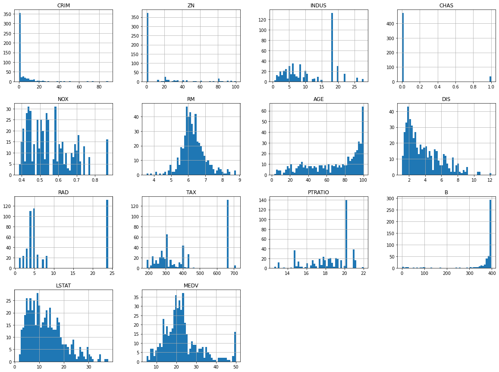

Real-Estate-Price-Prediction

# House Price Prediction using Linear Regression

This project aims to predict house prices based on various features using linear regression. It utilizes historical data on house prices and their associated features to train the model, which can then make predictions on new, unseen data.

## Project Overview

The goal of this project is to develop a machine learning model that can accurately predict house prices based on a set of input features. In this project, we will be using the linear regression algorithm, a widely used approach for solving regression problems.

## Dataset

The dataset used for this project contains historical information about house prices and their corresponding features. It consists of a CSV file with multiple columns, including the target variable (house prices) and various independent variables (features). The dataset should be stored in the `data` directory of this project.

 
Model of Project ☑☑
  + Supervised 
  + Regression Task
  + Batch Learning
