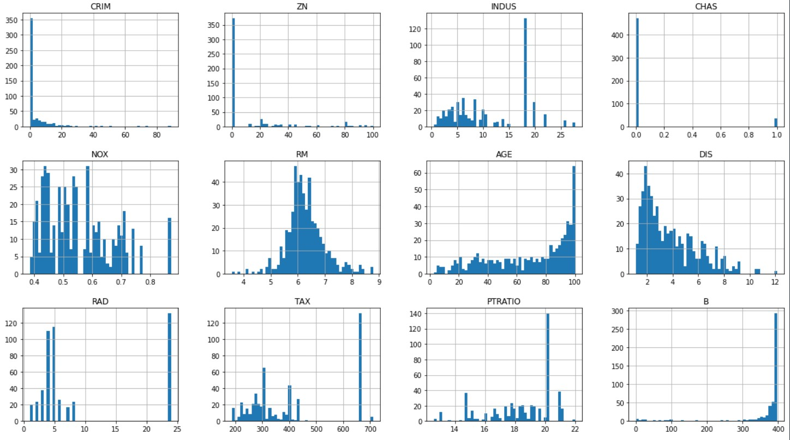

# Real-Estate-Price-Prediction using Linear Regression

Graphical attributes correlation

This project aims to predict house prices based on various features using linear regression. It utilizes historical data on house prices and their associated features to train the model, which can then make predictions on new, unseen data.

## Project Overview

The goal of this project is to develop a machine learning model that can accurately predict house prices based on a set of input features. In this project, we will be using the linear regression algorithm, a widely used approach for solving regression problems.

## Dataset

The dataset used for this project contains historical information about house prices and their corresponding features. It consists of a CSV file with multiple columns, including the target variable (house prices) and various independent variables (features). The dataset should be stored in the `data` directory of this project.

 
Model of Project ☑☑
  + Supervised 
  + Regression Task
  + Batch Learning

  ## Features   
  CRIM: This feature represents the per capita crime rate by town. It indicates the crime rate in the area where the house is located.

ZN: This feature represents the proportion of residential land zoned for lots over 25,000 sq.ft. It provides information about the amount of land available for large residential lots in the town.

INDUS: This feature represents the proportion of non-retail business acres per town. It indicates the amount of land in the town dedicated to non-retail businesses, such as industrial or commercial areas.

CHAS: This feature is a dummy variable that equals 1 if the property is located along the Charles River and 0 otherwise. It provides information about whether the property is located near the river.  
